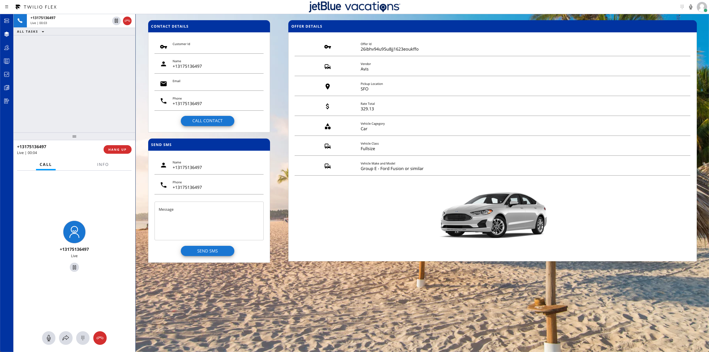

# JetBlue ByBlue Twilio Flex POC - Flex Plugin

Twilio Flex allows customer to customize the Flex UI by creating Flex Plugins built with React.js. 

<p aligh="center">
    

Twilio Flex Plugins allow you to customize the appearance and behavior of [Twilio Flex](https://www.twilio.com/flex). If you want to learn more about the capabilities and how to use the API, check out our [Flex documentation](https://www.twilio.com/docs/flex).

## Prerequisites

To deploy this plugin, you will need:
- An active Twilio account. [Sign up](https://www.twilio.com/try-twilio) if you don't already have one
- npm version 5.0.0 or later installed (type `npm -v` in your terminal to check)
- Node.js version 10.12.0 or later installed (type `node -v` in your terminal to check)
- A Flex instance (on flex.twilio.com) running v1.22.0 or higher where you have owner, admin, or developer permissions
- [Twilio CLI](https://www.twilio.com/docs/twilio-cli/quickstart#install-twilio-cli) along with the [Flex CLI Plugin](https://www.twilio.com/docs/twilio-cli/plugins#available-plugins) and [Serverless Plugin](https://www.twilio.com/docs/twilio-cli/plugins#available-plugins). Run the following in a command shell:
   ```
     # Install the Twilio CLI
     npm install twilio-cli -g
     # Install the Serverless and Flex as Plugins
     twilio plugins:install @twilio-labs/plugin-serverless
     twilio plugins:install @twilio-labs/plugin-flex@beta
   ```
- Pull this git repo to your local machine

## Setup The Plugin

Open terminal and navigate to the plugin directory, install the dependencies by running 

```bash
$ npm install
```

## Prerequisite Function

This Flex Plugin leverages 2 Twilio Functions, located in the `functions` folder. After deploying the Twilio Functions, update the appropriate file to call the correct Function URL. 

* get-offer.js - Update the `src\components\Panel2.js` file
* send-sms.js - Update the `src\components\SmsView.js` file

## Development and Test

In order to develop locally, you can use the Webpack Dev Server by running:

```bash
$ twilio flex:plugins:start
```

This will automatically start up the Webpack Dev Server and open the browser for you. Your app will run on `http://localhost:3000`. If you want to change that you can do this by setting the `PORT` environment variable:

## Deploy

When you are ready to deploy your plugin, in your terminal run:

```bash
$ twilio flex:plugins:deploy --major --changelog "Initial plugin deployment" --description "ByBlue Flex POC"
```

This will deploy your plugin to your Twilio Flex Project. See [Deploy and release using the Flex Plugins CLI](https://www.twilio.com/docs/flex/developer/plugins/cli/deploy-and-release#deploying-a-major-version-of-a-plugin) for more information

## Release
Last step is to release the plugin.  The above command will provide the text to copy and paste for releasing the plugin. The text will look like:

```bash
$ twilio flex:plugins:release --plugin plugin-jtp-byblue@1.0.0 --name "Autogenerated Release " --description "The description of this Flex Plugin Configuration"
```
## Configuration

This plugin will leverage data that is both passed from Twilio Studio as well as data pulled from a Twilio Function.

### Studio

Using Twilio Studio set these task attributes on the Send to Flex widget. 

* crmId - Set this to a unique identifier for the customer
* name - Customer name, this will also be used on the first line of the contact card
* phone - Callers phone number `{{trigger.call.From}}`
* email - Callers email address
* address - Callers address

---

## Plugin Structure

The `src\` folder contains all the files that make up this plugin. 

- `src\JTPByBluePlugin.js` - This is the main plugin file. This fill performs the following
  - Loads a custom theme from JTPTheme.js
  - Adds additional information to the TaskInfoPanel
  - Sets the default width of the Task splitter
  - Adds Listners (Used in Panel2.js) to set state data
  - Sets the CRM window (Panel 2) to the panel2.js file
- `components\Panel2.js` - The basic structure of CRM/Panel2
  - Maps TaskAttributes to the contactData state
  - Runs a Twilio Function to return the Offer object
  - Maps the Offer to the contactData state
  - Check if to see if a task is selected and calls the appropriate React Components
- `components\InfoComponent.js` - React Component for building the text elements of the various view.
- `components\SubheadingComponent.js` - React component for building the header of the various views
- `components\CustomerView.js` - Customer View with the Click to Call action `startOutboundCall`
- `components\GeneralView.js` - General view use to iframe the crmUrl attribute, this is not in use for this example.
- `components\OfferView.js` - Offer view used to display data from the Offer json object.  This Component calls the `get-offer.js` function.
- `components\SmsView.js` - SMS view use to enter a message and deliver it for SMS.  This component calls the `send-sms.js` function. **Note:** This view will not load for SMS tasks. 
- `src\functions\` - contains the .js function code for Twilio Functions  **Note:** These functions were originally deployed with Functions V1 by copying over to Twilio Functions. For production it is recommended to use Twilio Serverless. 


---


For more details on deploying your plugin, refer to the [deploying your plugin guide](https://www.twilio.com/docs/flex/plugins#deploying-your-plugin).

Note: Common packages like `React`, `ReactDOM`, `Redux` and `ReactRedux` are not bundled with the build because they are treated as external dependencies so the plugin will depend on Flex to provide them globally.