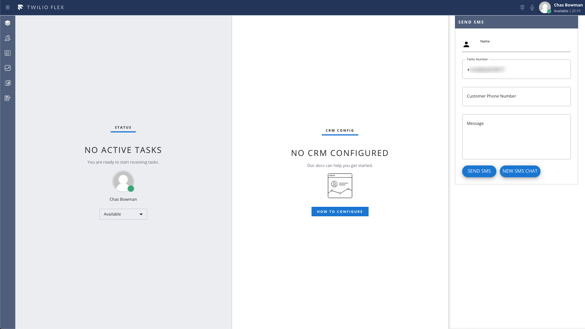

# Flex Outbound SMS Plugin

Twilio Flex allows customer to customize the Flex UI by creating Flex Plugins built with React.js. 

<p align="center">
    

Twilio Flex Plugins allow you to customize the appearance and behavior of [Twilio Flex](https://www.twilio.com/flex). If you want to learn more about the capabilities and how to use the API, check out our [Flex documentation](https://www.twilio.com/docs/flex).

## Prerequisites

To deploy this plugin, you will need:
- An active Twilio account. [Sign up](https://www.twilio.com/try-twilio) if you don't already have one
- npm version 5.0.0 or later installed (type `npm -v` in your terminal to check)
- Node.js version 10.12.0 or later installed (type `node -v` in your terminal to check)
- A Flex instance (on flex.twilio.com) running v1.22.0 or higher where you have owner, admin, or developer permissions
- [Twilio CLI](https://www.twilio.com/docs/twilio-cli/quickstart#install-twilio-cli) along with the [Flex CLI Plugin](https://www.twilio.com/docs/twilio-cli/plugins#available-plugins) and [Serverless Plugin](https://www.twilio.com/docs/twilio-cli/plugins#available-plugins). Run the following in a command shell:
   ```
     # Install the Twilio CLI
     npm install twilio-cli -g
     # Install the Serverless and Flex as Plugins
     twilio plugins:install @twilio-labs/plugin-serverless
     twilio plugins:install @twilio-labs/plugin-flex@beta
   ```
- Pull this git repo to your local machine

## Create Outbound Flex Flows

Run the following Twilio CLI command for each phone number that will be use to create Flex Tasks for outbound SMS. 

```bash
twilio api:flex:v1:flex-flows:create --integration-type task --no-enabled  --friendly-name "Outbound Flex Flow" --channel-type sms --contact-identity +XXXXXXXXXXX --chat-service-sid ISXXXXXXXXXXXXXXXXXXXXXXXXXXXXXXXX --integration.workspace-sid WSXXXXXXXXXXXXXXXXXXXXXXXXXXXXXXXX --integration.workflow-sid WWXXXXXXXXXXXXXXXXXXXXXXXXXXXXXXXX --integration.channel TCXXXXXXXXXXXXXXXXXXXXXXXXXXXXXXXX --janitor-enabled
```

## Prerequisite Function

This Flex Plugin leverages 2 Twilio Functions, located in the `functions` folder. After deploying the Twilio Functions. This version leverages Functions (Classic).

1. Navigate to [Function Configurations](https://www.twilio.com/console/functions/configure)
2. Check Enable ACCOUNT_SID and AUTH_TOKEN
3. Add TWILIO_PROXY_SERVICE_SID as an Environment Variable, set it as the [Flex Proxy Service SID](https://www.twilio.com/console/proxy)
4. Add the required NPM modules as Dependencies
   * twilio-flex-token-validator
   * node-fetch
   * js-base64
5. [Deploy Functions](https://www.twilio.com/console/functions/manage)
   * flex-sms-task.js
   * send-sms.js
## How to use the Plugin

### Environment Variables

Copy .env.example to .env. and set the following variables:
   * REACT_APP_SERVICE_BASE_URL: your Twilio Functions base url (this will be available after you deploy your functions). This should be just the base url (Example: https://some-words-1234.twil.io make sure to not include anything after the .io) 
   * REACT_APP_DEFAULT_TWILIO_NUMBER: The default Twilio Number to be used for sending sms messages, in E.164 format. 

  **Note**: Remember that both .env.development and .env.production is for front-end use so do not add any type of key/secret variable to them. When developing, the .env.development is used while the .env.production is used when building and deploying the plugin. Also, just variables starting with the name *REACT_APP_* will work.

### Installing dependencies 
Open terminal and navigate to the plugin directory, install the dependencies by running 

```bash
$ npm install
```

### Development and Test

In order to develop locally, you can use the Webpack Dev Server by running:

```bash
$ twilio flex:plugins:start
```

This will automatically start up the Webpack Dev Server and open the browser for you. Your app will run on `http://localhost:3000`. If you want to change that you can do this by setting the `PORT` environment variable:

### Deploy

When you are ready to deploy your plugin, in your terminal run:

```bash
$ twilio flex:plugins:deploy --major --changelog "Initial plugin deployment" --description "ByBlue Flex POC"
```

This will deploy your plugin to your Twilio Flex Project. See [Deploy and release using the Flex Plugins CLI](https://www.twilio.com/docs/flex/developer/plugins/cli/deploy-and-release#deploying-a-major-version-of-a-plugin) for more information

### Release
Last step is to release the plugin.  The above command will provide the text to copy and paste for releasing the plugin. The text will look like:

```bash
$ twilio flex:plugins:release --plugin plugin-outbound-sms@1.0.0 --name "Autogenerated Release " --description "The description of this Flex Plugin Configuration"
```

## Plugin Structure

The `src\` folder contains all the files that make up this plugin. 

- `src\FlexOutboundSms.js` - This is the main plugin file and loads SmsView.js into Panel3
- `components\SubheadingComponent.js` - React component for building the header of the various views
- `components\SmsView.js` - SMS view use to enter a message and deliver it for SMS.  This component calls the `send-sms.js` and `flex-sms-task.js` function.
- `src\functions\` - contains the .js function code for Twilio Functions  **Note:** These functions were originally deployed with Functions V1 by copying over to Twilio Functions. For production it is recommended to use Twilio Serverless. 


---
For more details on deploying your plugin, refer to the [deploying your plugin guide](https://www.twilio.com/docs/flex/plugins#deploying-your-plugin).

Note: Common packages like `React`, `ReactDOM`, `Redux` and `ReactRedux` are not bundled with the build because they are treated as external dependencies so the plugin will depend on Flex to provide them globally.